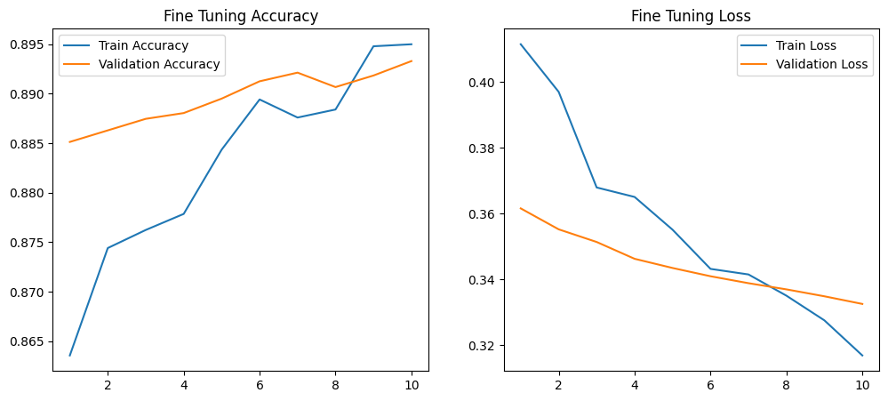

# Food Image Classification with EfficientNetB0

This project applies **transfer learning** using EfficientNetB0 to classify images from the **Food dataset**.  
Two transfer learning approaches were evaluated:

1. **Feature Extraction**
2. **Fine-Tuning**

The goal is to compare both approaches and analyze model performance.

---

# Dataset

The experiments use the **Food image dataset**, which contains images across **11 food categories**:

- Bread
- Dairy product
- Dessert
- Egg
- Fried food
- Meat
- Noodles-Pasta
- Rice
- Seafood
- Soup
- Vegetable-Fruit

Dataset splits:

| Split | Images |
|------|------|
Training | 9866 |
Validation | 3430 |
Test | 3347 |

Images were resized to **224 × 224** before being fed into the model.

---

# Model

The base architecture used is **EfficientNetB0.

---

# Experiment 1 — Feature Extraction

In this experiment, the EfficientNetB0 base model was used as a **fixed feature extractor**.

All pretrained layers were **frozen**, and only the classification head was trained on the dataset.

### Training Results

- Train accuracy increased from **0.7166 → 0.8833**
- Validation accuracy improved from **0.8294 → ~0.875**

Both training and validation loss decreased steadily during training.

### Metrics Plot

---

# Experiment 2 — Fine-Tuning

In this experiment, the last layers of EfficientNetB0 were **unfrozen** and retrained using a **smaller learning rate**.

This allows the pretrained network to adapt its features to the target dataset.

### Training Results

- Train accuracy improved from **0.8636 → 0.8950**
- Validation accuracy improved from **0.8851 → 0.8933**

Both training and validation loss decreased consistently.

### Metrics Plot

---

# Observations

### Feature Extraction vs Fine-Tuning

Feature extraction already achieved strong performance by using pretrained EfficientNetB0 features without updating the base network.

Fine-tuning further improved the model by unfreezing the last layers of the network and allowing them to adapt to the Food dataset.

Although the improvement is moderate, it shows that updating deeper layers helps the model learn more visual patterns.

---

### Generalization

Both experiments demonstrated good generalization.  
The training and validation curves remained close.
---

### Convergence

Training curves show smooth and stable convergence.  
Accuracy increased gradually while loss decreased consistently across epochs.

---

### Overfitting

No strong signs of overfitting were observed.  
Training and validation metrics remained close throughout training and validation loss continued to decrease.

## 🔗 Helpful Links

- 📚 EfficientNet models in Keras:  
  https://keras.io/api/applications/efficientnet/

- 🎓 Transfer Learning guide (Keras):  
  https://keras.io/guides/transfer_learning/

- 📦 MLflow for experiment tracking:  
  https://www.mlflow.org/docs/latest/index.html

- ☁️ DVC + DagsHub integration:  
  https://dagshub.com/docs/integrations/dvc/

- 🧑‍🍳 How to freeze/unfreeze layers in Keras:  
  https://keras.io/getting_started/faq/#how-can-i-freeze-layers-in-a-model

- 📈 Using callbacks in Keras (e.g. EarlyStopping, ReduceLROnPlateau):  
  https://keras.io/api/callbacks/
